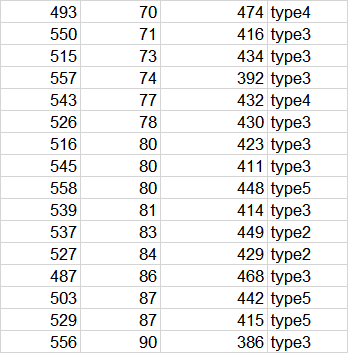

# UCB-Based
This code is used to do simulation experiments. The Multi-armed Bandit algorithm is used to learn user request preferences in the edge server and users' local cache.

# Requirements
Python 3.5+

# How to use
Firstly, "UCB1.py" is the main function file.

Secondly, preparing an excel file as shown in the figure below, in which 1000 pieces of data are needed to be prepared.

# Maintainer
Hung-hsuan (1115399596@qq.com)
